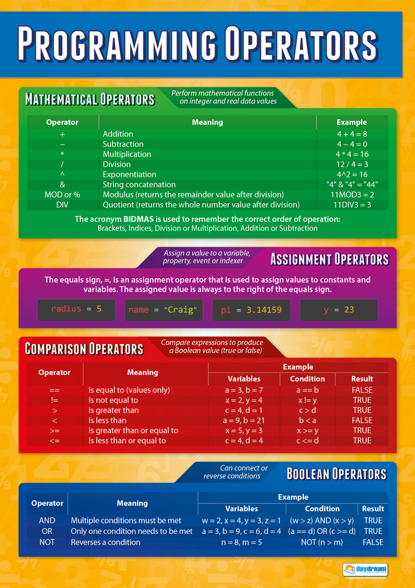
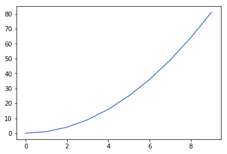
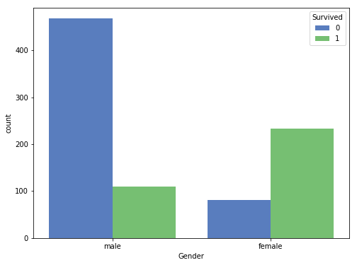
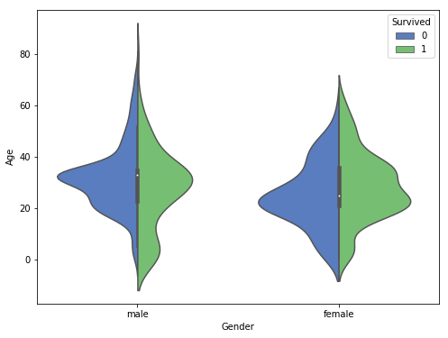
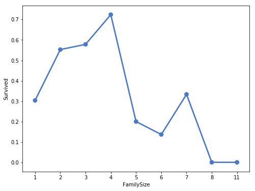
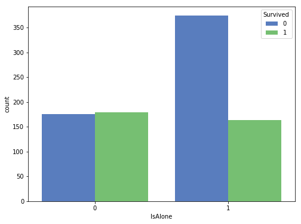
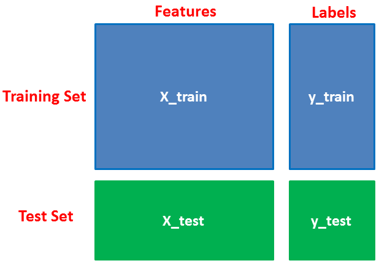
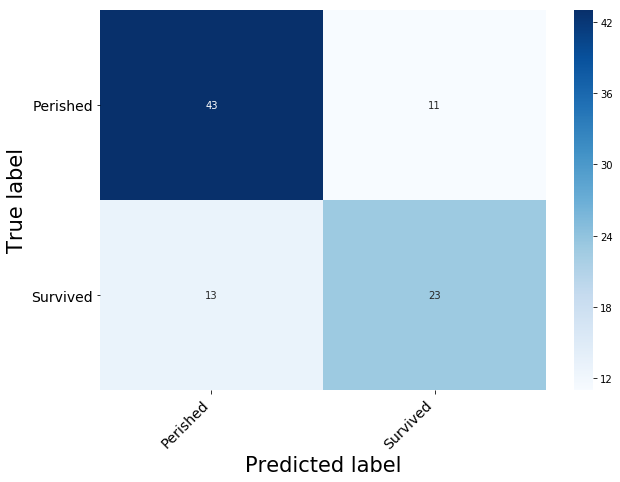

# Titanic Model

Demo for a simple app to host a fitted model, trained on a subset of the titanic disaster dataset.
The model was fitted on three dimensions of data, therefore, if we can input these three dimensions: the person's Gender, their Age, and whether or not they travelled alone, the model should be able to return whether or not that person would have durvived the titanic as well as a (%) chance of survival.

[](https://mybinder.org/v2/gh/SoftStackFactory/titanic-demo/master)
<hr>

**Important Note:** To save your work and notes for later navigate to the `File` tab on the top of the noteboook and click `Download as Notebook (.ipynb)` 

## Understanding How To Use A Jupyter Notebook

### <span style="color:red"> ***Click Me*** </span>

If you see this cell turn blue that means this cell is focused

### <span style="color:red"> ***Double Click Me*** </span>

If you see this cell turn green that means this cell is selected for edit.
To get out of edit mode, click `shift` and `enter` at the same time.
This will run the cell with the edits you made, if you made any at all and shift the focus to the cell below. 

You can also press `ESC` or `Escape` to switch from edit mode to focus mode. **Note** that you need to run the cell for any markdown style to take effect, do this by clicking `shift` and `enter` at the same time.


### <span style="color:red"> ***Click Me Again*** </span>

If you see this cell turn blue that means this cell is focused. 

**When the cell is focused you can press keys on the keyboard to help you navigate the notebook cells easier.**

**Once A Cell Is Selected You Can Press The Following Keys For Their Respective Actions:**
- `up arrow` - shift focus to cell above
- `down arrow` - shift focus to cell below


- `Enter` - edit cell after cell is selected
- `Shift and Enter` runs the cell and then shifts focus to the cell below.


- `a` - insert cell above the selected cell
- `b` - insert cell below the selected cell


- `m` - changes the cell type to a markdown cell, which allows you to write notes about code cells
- `y` - changes the cell type to a code cell, which allows you to write and execute code.


- `dd` - (double pressing `d`) will delete the selected cell. If you accidently delete a cell navigate to the *`Edit`* toolbar near the top of the screen and click `Undo Delete Cells`


<hr>

### This Is A ***`Markdown`*** Cell

Use markdown cells to write notes about your code and experiments.

Once focused click `Enter` to edit the markdown cell, once finished click `Shift` and `Enter` at the same time for the edits to take place.

*Code cells look different than mark down cells.*

<hr>


```python
# This is a code cell
```


```python
# Once focused click `Enter` to edit the code cell

print("Hello!") # Press shift and enter to run cell to see output
```

    Hello!


<hr>

## Python Fundamentals

### *Declaring* Variables

We can save some `value`, the result of a `calculation`, or even the output of a `function` to a `variable`. This is particularly important for making your code `concise`, `readable`, and `efficient`.

**Try Running the code cell below pressing `shift` and `enter` at the same time after there is focus on the cell:**


```python
# Declare variables with specific values so that we can use them later in the notebook code cells
a = 1
b = 2

print(a) # Print the value of `a` to the screen
print(b) # Print the value of `b` to the screen
```

    1
    2


```python
# Declare variables
text_one = "Hello"
text_two = "World!"

print(text_one, text_two)
```

    Hello World!


### Operations On Variables

#### Addition **`+`**
The `+` symbol is works differently depending on the data type of the value of the variable.

Run the following code to notice the difference:


```python
print(a + b) # Output is a number data type

print(text_one + text_two) # Output is a text data type; Note there are no spaces
```

    3
    HelloWorld!


<br>

**Other operators:**

- `-`: subtraction
- `*`: multiplication
- `//`: whole number division
- `/`: floating point division


Operator precedence in calculation: **PEMDAS**




<br>

### Learn more:
<a href="https://github.com/SoftStackFactory/titanic-demo/blob/master/assets/beginners-python-cheat-sheets.pdf"> Other Python programming cheat sheets<a>

<br>

## Importing Necessary Libraries 
Libraries are groupings of code written by other developers. We use libraries so that we do not need to reinvent the wheel to do common programming tasks. 

#### Import `pandas` and `numpy`  for Data Manipulation

The ***`as`*** keyword maps a library to a shorted expression that can be used in later code, this way if the library name is super long we don't have to type as many characters every time we want to use one of the libraries functions. 


```python
import pandas as pd # import pandas as an alias called `pd` 
import numpy as np# import numpy as an alias called `np` 
```

<br>

#### import `matplotlib` and `seaborn` for data visualization


```python
import matplotlib.pyplot as plt
import seaborn as sns
plt.style.use('seaborn-muted')
```

<br>

#### Import `SkLearn` functions to model Data


```python
# To Split Dataset
from sklearn.model_selection import train_test_split


# Import Model
from sklearn.ensemble import GradientBoostingClassifier


# Model Evaluation
from sklearn.metrics import confusion_matrix
from sklearn.metrics import accuracy_score
```

<br>

#### Import `joblib` to save finished model


```python
import joblib
```

<br>
<br>
<br>
<br>
<hr>

## Load Data


```python
df = pd.read_csv('./data/titanic.csv')
```


```python
df.head()
```


<div>
<style scoped>
    .dataframe tbody tr th:only-of-type {
        vertical-align: middle;
    }

    .dataframe tbody tr th {
        vertical-align: top;
    }

    .dataframe thead th {
        text-align: right;
    }
</style>
<table border="1" class="dataframe">
  <thead>
    <tr style="text-align: right;">
      <th></th>
      <th>PassengerId</th>
      <th>Survived</th>
      <th>Pclass</th>
      <th>Name</th>
      <th>Gender</th>
      <th>Age</th>
      <th>SibSp</th>
      <th>ParCh</th>
      <th>Ticket</th>
      <th>Fare</th>
      <th>Cabin</th>
      <th>Embarked</th>
      <th>Title</th>
    </tr>
  </thead>
  <tbody>
    <tr>
      <th>0</th>
      <td>1</td>
      <td>0</td>
      <td>3</td>
      <td>Braund, Mr. Owen Harris</td>
      <td>male</td>
      <td>22.0</td>
      <td>1</td>
      <td>0</td>
      <td>A/5 21171</td>
      <td>7.2500</td>
      <td>NaN</td>
      <td>S</td>
      <td>Mr</td>
    </tr>
    <tr>
      <th>1</th>
      <td>2</td>
      <td>1</td>
      <td>1</td>
      <td>Cumings, Mrs. John Bradley (Florence Briggs Th...</td>
      <td>female</td>
      <td>38.0</td>
      <td>1</td>
      <td>0</td>
      <td>PC 17599</td>
      <td>71.2833</td>
      <td>C85</td>
      <td>C</td>
      <td>Mrs</td>
    </tr>
    <tr>
      <th>2</th>
      <td>3</td>
      <td>1</td>
      <td>3</td>
      <td>Heikkinen, Miss. Laina</td>
      <td>female</td>
      <td>26.0</td>
      <td>0</td>
      <td>0</td>
      <td>STON/O2. 3101282</td>
      <td>7.9250</td>
      <td>NaN</td>
      <td>S</td>
      <td>Miss</td>
    </tr>
    <tr>
      <th>3</th>
      <td>4</td>
      <td>1</td>
      <td>1</td>
      <td>Futrelle, Mrs. Jacques Heath (Lily May Peel)</td>
      <td>female</td>
      <td>35.0</td>
      <td>1</td>
      <td>0</td>
      <td>113803</td>
      <td>53.1000</td>
      <td>C123</td>
      <td>S</td>
      <td>Mrs</td>
    </tr>
    <tr>
      <th>4</th>
      <td>5</td>
      <td>0</td>
      <td>3</td>
      <td>Allen, Mr. William Henry</td>
      <td>male</td>
      <td>35.0</td>
      <td>0</td>
      <td>0</td>
      <td>373450</td>
      <td>8.0500</td>
      <td>NaN</td>
      <td>S</td>
      <td>Mr</td>
    </tr>
  </tbody>
</table>
</div>


**Remove the `#` symbol in the code cell below to temporarily remove the survived column from the data frame and print it to the screen**


```python
# df.iloc[:1].drop(['Survived'], axis=1)
```

<br>
<br>
<br>
<br>

# 1. Explatory Data Analysis
<hr>

### ASIDE: matplotlib.pyplot

#### Built-in Docs: `?`

**Remove the `#` symbol in the code cell below to look at the documentation for any library function you want to learn how to use**


```python
# np.random.randint?
```

#### Generating random data


```python
a = np.random.randint(low=0, high=10, size=10)
print(a)
```

    [2 4 9 6 1 8 8 5 8 7]


#### Generating structured data


```python
# Data
x = np.arange(10)
y = x**2

# print(x)
# print(y)
```

#### Generic plot


```python
# Figure
fig = plt.figure()

# Axis
ax = fig.gca()

# Plot
ax.plot(x,y)

# Show it on screen.
plt.show()
```





<br>

## Women and Children?

### `Gender` vs. `Survived`


```python
# Place the table
fig = plt.figure(figsize=(8,6))

# Put sheet on table
ax = fig.gca()

# Draw plot on sheet
sns.countplot(df['Gender'], hue=df['Survived'], ax=ax)

# Output the plot to the screen
plt.show()
```





<br>

### `Age` and `Gender` VS. `Survived`


```python
fig = plt.figure(figsize=(8,6))
ax = fig.gca()
sns.violinplot("Gender", "Age", hue = "Survived", data = df, split = True)

plt.show()
```





<br>
<br>
<br>
<br>

# 2. Feature Engineering and Preprocessing
<hr>

## Where You travelling Alone ?

#### `FamilySize`


```python
df['FamilySize'] = df['SibSp'] + df['ParCh'] + 1
```

#### How does `FamilySize` impact `Survived`


```python
# Place the table
fig = plt.figure(figsize=(8,6))

# Put sheet on table
ax = fig.gca()

# Draw plot on sheet
sns.catplot(x='FamilySize', y='Survived', data=df, kind="point", ci=None, ax=ax)

# Output the plot to the screen
plt.close(2)
plt.show()
```





<br>

#### `IsAlone`


```python
df['IsAlone'] = 0
```


```python
# df.head()
```


```python
df.loc[df['FamilySize'] == 1, "IsAlone"] = 1
```

#### How does `IsAlone` impact `Survived`


```python
# Place the table
fig = plt.figure(figsize=(8,6))

# Put sheet on table
ax = fig.gca()

# Draw plot on sheet
sns.countplot(df['IsAlone'], hue=df['Survived'], ax=ax)

# Output the plot to the screen
plt.show()
```





<br>

## Drop All Columns except for `Age`, `Gender`, and `IsAlone`


```python
df = df.drop(['PassengerId', 'Pclass', 'Name', 'SibSp',
       'ParCh', 'Ticket', 'Fare', 'Cabin', 'Title','FamilySize', 'Embarked'], axis=1)
```

<br>

## Label Encoding
Most machine learning models cannot interpret string values directly, we must encode them into numerical values!

### Convert `Gender` into a binary column: `IsFemale`


```python
df['IsFemale'] = df['Gender'].replace(['male','female'],[0,1])
```


```python
df = df.drop(['Gender'],axis=1)
```


```python
df.head()
```


<div>
<style scoped>
    .dataframe tbody tr th:only-of-type {
        vertical-align: middle;
    }

    .dataframe tbody tr th {
        vertical-align: top;
    }

    .dataframe thead th {
        text-align: right;
    }
</style>
<table border="1" class="dataframe">
  <thead>
    <tr style="text-align: right;">
      <th></th>
      <th>Survived</th>
      <th>Age</th>
      <th>IsAlone</th>
      <th>IsFemale</th>
    </tr>
  </thead>
  <tbody>
    <tr>
      <th>0</th>
      <td>0</td>
      <td>22.0</td>
      <td>0</td>
      <td>0</td>
    </tr>
    <tr>
      <th>1</th>
      <td>1</td>
      <td>38.0</td>
      <td>0</td>
      <td>1</td>
    </tr>
    <tr>
      <th>2</th>
      <td>1</td>
      <td>26.0</td>
      <td>1</td>
      <td>1</td>
    </tr>
    <tr>
      <th>3</th>
      <td>1</td>
      <td>35.0</td>
      <td>0</td>
      <td>1</td>
    </tr>
    <tr>
      <th>4</th>
      <td>0</td>
      <td>35.0</td>
      <td>1</td>
      <td>0</td>
    </tr>
  </tbody>
</table>
</div>


<br>
<br>
<br>
<br>

# 3. Create Model
<hr>

## A. Split Dataset into `train` and `test`
**We split the dataset into two sets:**
* `X_train` and `y_train`: Will be passed into the model to learn the patterns in the data
* `X_test` and `y_test`: Will be used to test the validity of the model's predictions.




```python
features = df.drop(['Survived'], axis=1)
labels = df['Survived']
```


```python
X_train, X_test, y_train, y_test = train_test_split(features, labels, train_size=0.90, random_state=100)
```

    /srv/conda/envs/notebook/lib/python3.7/site-packages/sklearn/model_selection/_split.py:2179: FutureWarning: From version 0.21, test_size will always complement train_size unless both are specified.
      FutureWarning)


### Check Dimensions


```python
print("X_train:", X_train.shape, "y_train:", y_train.shape)
```

    X_train: (801, 3) y_train: (801,)


```python
print("X_test:", X_test.shape, "y_test:", y_test.shape)
```

    X_test: (90, 3) y_test: (90,)


<br>

## B. Train Model

The parameters that I passed in are called `hyperparameters`, these were "discovered" through a process called cross-validation, which can be applied with the `SciKit_Learn` function `GridSearchCV`


```python
model = GradientBoostingClassifier(learning_rate=0.02, n_estimators=200, max_features=None)
```


```python
model.fit(X_train.values, y_train.values)
```


    GradientBoostingClassifier(criterion='friedman_mse', init=None,
                  learning_rate=0.02, loss='deviance', max_depth=3,
                  max_features=None, max_leaf_nodes=None,
                  min_impurity_decrease=0.0, min_impurity_split=None,
                  min_samples_leaf=1, min_samples_split=2,
                  min_weight_fraction_leaf=0.0, n_estimators=200,
                  n_iter_no_change=None, presort='auto', random_state=None,
                  subsample=1.0, tol=0.0001, validation_fraction=0.1,
                  verbose=0, warm_start=False)


## C. Make Predictions on X_test


```python
predictions = model.predict(X_test)
```

<br>
<br>
<br>
<br>

# 4. Evaluate Model Performance 

<hr>

### A. Check `accuracy` of `predictions` by comparing to  `y_test`


```python
accuracy_score(y_test, predictions)
```


    0.7333333333333333


### B. Check `confusion_matrix` of `predictions`


```python
def print_confusion_matrix(confusion_matrix, class_names, figsize = (10,7), fontsize=14):
#     prep work
    df_cm = pd.DataFrame(confusion_matrix, index=class_names, columns=class_names)
    fig = plt.figure(figsize=figsize)
    ax = fig.gca()
    
#     make Heatmap and set custom tick marks
    heatmap = sns.heatmap(df_cm, annot=True, fmt="d", cmap='Blues')
    heatmap.yaxis.set_ticklabels(heatmap.yaxis.get_ticklabels(), rotation=0, ha='right', fontsize=fontsize)
    heatmap.xaxis.set_ticklabels(heatmap.xaxis.get_ticklabels(), rotation=45, ha='right', fontsize=fontsize)
    
#     Set plot labels
    ax.set_ylabel('True label', fontsize=fontsize*1.5)
    ax.set_xlabel('Predicted label',fontsize=fontsize*1.5)
    
    return fig
```


```python
cm = confusion_matrix(y_test,predictions)
labels = ["Perished","Survived"]
```


```python
_ = print_confusion_matrix(confusion_matrix = cm, class_names=labels)
```





<br>
<br>
<br>
<br>

# 5. Export Model
<hr>


```python
joblib.dump(model, './models/titanic_grad_boost.joblib') 
```


    ['./models/titanic_grad_boost.joblib']


